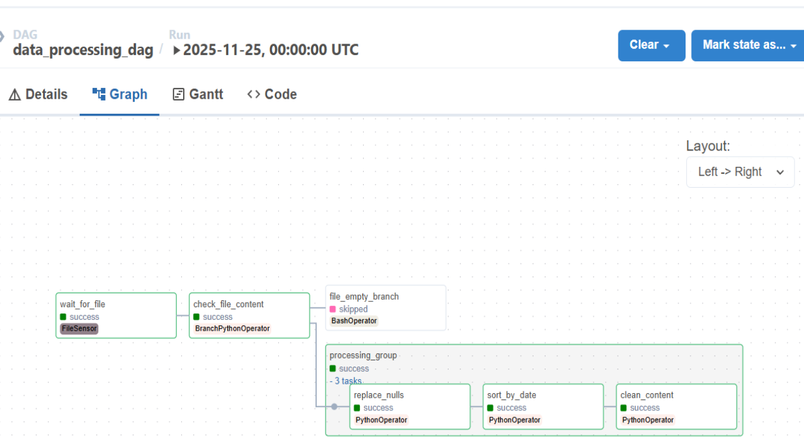

# Airflow to MongoDB ETL Pipeline

This project demonstrates a local ETL pipeline using Apache Airflow, Docker, Pandas, and MongoDB.

## Features
- **FileSensor** to detect incoming data.
- **Branching** to handle empty files.
- **TaskGroup** for modular data cleaning (Pandas).
- **Data-aware scheduling** (Datasets) to trigger the loading DAG.
- **MongoDB** integration.

## Setup
1. Ensure Docker and Docker Compose are installed.
2. Run `docker-compose up -d`.
3. Place `tiktok_google_play_reviews.csv` into `data/` folder.
4. Activate DAGs in Airflow UI (`localhost:8080`).

## DAG Screenshot

